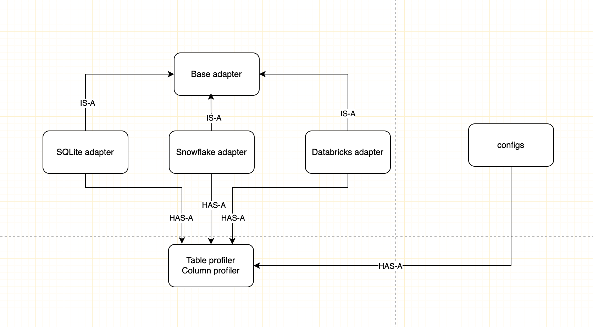

## Description
 Configurable data-profiling utility that can scan hundreds of tables across different databases and persist a compact summary of table/column metadata and statistics.

## Project setup
- uv init data-profiler (optional)
- uv venv
- source .venv/bin/activate
- uv sync

## Manual testing data setup
- python script/sqlite_db.py

## Run application
- python main.py

## Unit tests
- pytest 
- pytest --cov=.

## Output json format
`{
  "table_name": "users",
  "row_count": 1000,
  "columns": [
    {
      "name": "age",
      "type": "INTEGER",
      "nullable": true,
      "stats": {
        "min": 18,
        "max": 80,
        "distinct_count": 45,
        "null_count": 10,
        "histogram": [
            {
              "value": 35,
              "count": 1
            }
        ]
      }
    }
  ]
}`

## Component design diagram
